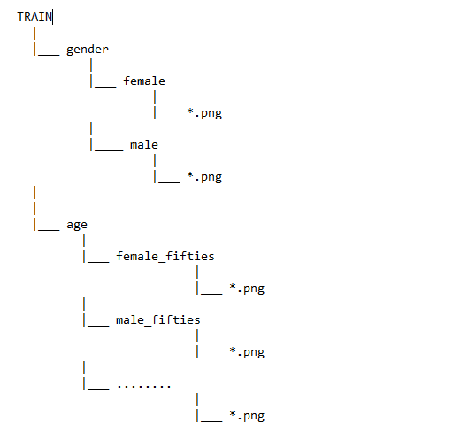

#### 21.09.2020
1. Доделаны флаер и Диаграмма Ганта

#### 23.09.2020
1. Закинула флаер и Диаграмму Ганта на диск

#### 24.09.2020
1. Закинула файл с содержанием некоторых статей на диск
2. Наконец-то написала что-то в git'е по workflow

#### 25.09.2020
1. Загрузила библиотеки librosa, matplotlib
2. Нашла какой-то код wav to mel-spect

#### 25.09.2020
1. Код работает!! Ой....

#### 27.09.2020
1. Код строит mel-спектограмму без ошибок

#### 28.09.2020
1. Стырила код отсюда https://pythonbasics.org/convert-mp3-to-wav/
2. Теперь код может конвертировать любое кол-во файлов mp3 в wav
3. Датасет наконец-то в формате wav

#### 29.09.2020
1. https://github.com.cnpmjs.org/OmarHory/VoiceGenderRecognition - отсюда беру модель
#### 04.09.2020 - 05.09.2020
1. Переделала код для конвертации mp3 в wav.
2. Сконвертировала все файлы датасета

#### 06.10.2020
1. Посмотрела видосики про загрузку датасетов и их подготовку
2. Скорректировала код для спектограммы, теперь функция загружает чистое изображение (без всех шкал)
3. Нашла функцию, которая переводит изображение в тензор (это же так говорится??) и показывает его расширение.
#### 07.10.2020
1. я.ботала.матан.
2. https://pythonprogramming.net/loading-custom-data-deep-learning-python-tensorflow-keras/ - пример загрузки датасета 
3. Желаю здоровья мудрому человеку с данного сайта https://stackoverflow.com/questions/11837979/removing-white-space-around-a-saved-image-in-matplotlib
т.к он решил проблему с белым окном вокруг спектограммы.
4. О, загрузила картиночки с jupiter на git
5. Теперь есть код, который сохраняет необходимые графики n-ого кол-ва файлов 
#### 08.10.2020
1. Ноутбук загрузил всего лишь 14к изображений по аудио. *плак*
2. Русскоязычный код загрузки/подготовки данных на примере котов и собак (постоянно теряю ссылку) https://github.com/sozykin/dlpython_course/blob/master/computer_vision/cats_and_dogs/data_preparation.ipynb
3. Добралась до csv-файлов, удалила ненужные столбцы и оставила только те названия аудио, в которых есть данные и о возрасте и о поле.
Придётся чистить папки с wav аудио и с изображениями? Или заново конвертировать? А, или просто буду проверять имя файла на наличие в списке csv 
4. Отредактировала файлы test, train, загрузила код на git. Проверила test и train на совпадения, всё хорошо.
#### 09.10.2020
1. Исправила ошибку с недостатком памяти при сохранении спектограммы (необходимо было закрыть окно графика с помощью функции plt.close())
2. Загружена половина датасета ~38к
3. Изменена модель свёрточной нейронной сети под изображение 432x288, добавлены новые слои Conv2D() и Dropout()
4. https://www.tensorflow.org/tutorials/load_data/images?hl=ru загрузка датасета *а смысл........*
5. Отредактировала train, test, validated файлы, в train отсутсвуют возраста двух категорий, скорее всего validated буду обучать модель
#### 10.10.2020
1. Проверила датасет на потерю данных или ещё чего, всё совпадает, cool
2. Отредактировала train, test, validated файлы, загрузла код
3. Ура, фулл dataset
#### 11.10.2020 - 12.10.2020
1. Отсортировала изображения по папкам
2. Загрузила код на гит
#### 14.10.2020 
1. Посмотрела видосик https://www.youtube.com/watch?v=q7ZuZ8ZOErE
2. Сломала анаконду.................
3. Некоторые пакеты получили в названии "-", к примеру -aplotlib, пришлось переустановить анаконду
4. Ого, я что-то загрузила. Чота долго обучается))
5. Тут про визуализацию данных и про методы против переобучения https://habr.com/ru/post/458170/
6. Тут говорят, что попробовать, если точность низкая https://ru.stackoverflow.com/questions/834469/keras-низкая-точность-нейронной-сети
#### 15. 10. 2020
1. Ноутбук обучил модель, которая предсказывает гендер по голосу, на одной эпохе. Обучалась часа 3. 
2. Загрузила датасет в модель, которая предсказывает возраст по голосу. Ещё не обучала, но на первой эпохе точность 0.1951, т.е чистое угадывание, 
в отличие от предыдущей модели, где точность на начале обучения была под 0,79
3. Проверила первую модель после обучения на первой эпохе на тестовых данных, loss: 1.9131 - accuracy: 0.8745,
на обучающей выборке loss: 3.0752 - accuracy: 0.7983, на val данных val_loss: 1.8196 - val_accuracy: 0.8807
4. Загрузила код на гит.
5. Больше ничего не успела.
#### 25.10.2020
1. Я тоже хочу пользоваться процессором ноутбука, поэтому самое время перейти на гугл колаб. 
2. Код для подключения диска и загрузки папок взяла тут https://github.com/alexeyk500/Fast_load_data_to_colab/blob/master/Быстрая%20загрузка%20данных%20в%20Colab%20c%20Google%20Disk.ipynb
3. Нашла ещё парочку статьей, в которых прочитала только аннтотацию))
#### 26.10.2020
1. Снова проблемы... Почему-то некоторые папки в датасете были удалены, ну да ладно.
2. Дописала полноценный код копирования спектограмм по папкам, залила код на git
3. Вот так выглядят мои папки на примере train

4. Перевела файлы в формат zip
5. Загрузила все файлы на Google Диск
6. Отредактировала модель нейросети - изменила ко-во нейронов на первом Dense слое, залила на git
7. Добро пожаловать https://gist.github.com/kanat3/0a0a19cafee96f1587c8ccdfea64da78 (обновила)
#### 27.10.2020 - 29.10.2020
1. Написала набросок статьи, абстракт, ключевые слова + название
2. Кстати, тексты докладов, которые скинули стажеры, не нашла. P.S Нашла
3. Урезала датасет, чтобы женщин/мужчин было 50/50 и чтобы он загружался на colab
4. Загрузила изменения на Drive
5. Снова не считываются все файлы из train, думаю, можно загружать папки gender.zip и age.zip, чтобы распаковывать меньше файлов за один раз
#### 03.11.2020
1. Пытаюсь улучшить точность нейросети, но все равно что-то не то. При изменении оптимизатора и функции активации точность на обучающей выборке в самом деле изменяется, но
потери на валидационных данных = const
2. Что до датасета, наверное, можно использовать открытые данные Mozila на английском 
3. Вот как выглядит датасет:

Возраст:
23% 19 - 29,
14% 30 - 39,
10% 40 - 49,
6% < 19,
4% 50 - 59,
4% 60 - 69,
1% 70 - 79

Пол:
47% -Мужской,
14% - Женский
#### 04.11.2020 - 05.11.2020
1. Скачала датасет, раскидала по папкам, осталось конвертировать в wav, потом в картинку. Для возраста в каждой категории около 6-7к аудио, кроме возрастных категорий:
79-89 и 89-99 лет
2. Загрузила код на гит
3. Подобрала оптимизатор под нейросеть, который хоть как-то её обучает. https://github.com/keras-team/keras/issues/1597#issuecomment-485651390
4. Чуть изменила модель CNN, сделав её более простой.
5. Распределение файлов в датасете пока такое 

#### 06.11.2020
1. Отредактировала кол-во аудио в датасете
2. Перевела весь датасет в wav, залила код на гит
3. Прикольный сайтик, там написали, что "Для функции потерь binary crossentropy в случае указания метрики 'accuracy' возвращает завышенные значения точности (binary_accuracy) Чтобы получить реальную точность, с binary crossentropy используется вдобавок метрика categorical_accuracy"
http://www.100byte.ru/python/factors/factors.html

#### 09.11.2020
1. Конвертация аудио в спектрограмму занимает оч много времени
2. Обучила нейронку, результат +/- нормальный
